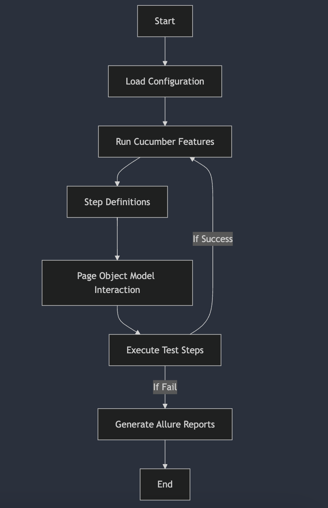

# Stakeland Playwright BDD Automation Framework

This repository contains an automated testing framework using Playwright, Cucumber BDD, and the Page Object Model (POM) design pattern. It is used to automate end-to-end tests for the Staking Simulator application.

## Prerequisites
Before running the tests, ensure that the following are installed on your system:

Node.js (v14+)
NPM
Playwright dependencies (Playwright will handle browser downloads)
Installation
Clone this repository:

bash
```
git clone https://github.com/waichun1003/stakeland-playwright.git
```

Navigate to the project directory:

bash
```
cd stakeland-playwright
```

Install the required Node.js dependencies:

bash
```
npm install
```

## Workflow Diagram



## Project Structure
The project is organized into the following main directories:

````
Copy code
|-- features/                    # Cucumber feature files
|   |-- staking-simulator.feature  # Contains test scenarios for staking simulator
|
|-- pages/                       # Page Object Model (POM) classes for different pages
|   |-- staking-simulator.js      # Staking simulator page object
|
|-- steps/                       # Step definitions for Cucumber scenarios
|   |-- staking-simulator.js      # Step definitions for staking simulator
|
|-- utils/                       # Utility classes and helper functions
|   |-- helpers.js                # Common utility functions
|
|-- playwright-report/           # Playwright HTML test reports
|   |-- report.html               # Latest HTML report for test execution
|
|-- test-results/                # JSON results of the last test run
|   |-- .last-run.json            # JSON output from last test execution
|
|-- playwright.config.js         # Playwright configuration file
|
|-- package.json                 # Project dependencies and scripts
````

## Key Files
- `staking-simulator.feature`: Cucumber feature file containing scenarios for the staking simulator.
- `staking-simulator.js` (Pages): Implements the Page Object Model pattern for interacting with elements on the staking simulator page.
- `staking-simulator.js` (Steps): Contains Cucumber step definitions mapped to the scenarios in the feature file.
- `playwright.config.js`: Configures the Playwright environment for browser settings, timeouts, and reports.


## Running the Tests
You can execute the Playwright tests using the following NPM scripts defined in `package.json`.

### Run All Tests
bash
````
npm run test
````

### Run Tests in Headed Mode
To run tests with the browser UI, use the following command:

bash
````
npm run testUI
````

### Generate and View Report (Optional)
- After running the tests, Allure Report will Automatically launch in browser

### Manual Steps to generate report
bash
````
npx allure generate allure-results --clean -o allure-report
````

and to Generate Allure Report:

bash
````
npx mkdir -p allure-results/history && cp -r allure-report/history/* allure-results/history/ || true
````

To View Allure Report:

bash
```
allure serve
```

### Configuration
#### Playwright Configuration
The Playwright configuration file (`playwright.config.js`) allows you to customize the testing environment, including:

- Browsers: Choose between Chromium, Firefox, or WebKit.
- Headless Mode: Run tests in headless mode or with UI.
- Timeouts: Set global and per-test timeouts.
- Reports: Generate test reports in different formats (e.g., HTML, JSON).

## Cucumber Options
Cucumber options like the location of feature files and the format for test results are defined in the step definition files and the Playwright config.

## Continuous Integration
This project includes a sample GitHub Actions workflow file (`.github/workflows/playwright.yml`) for continuous integration.

## Running Tests in CI
1. Push your changes to the repository.
2. GitHub Actions will automatically trigger the Playwright tests as defined in the workflow.